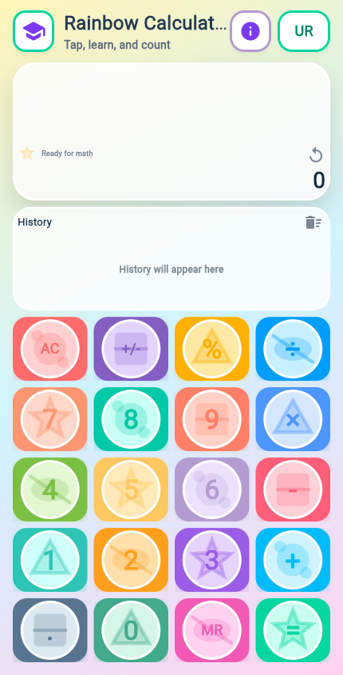
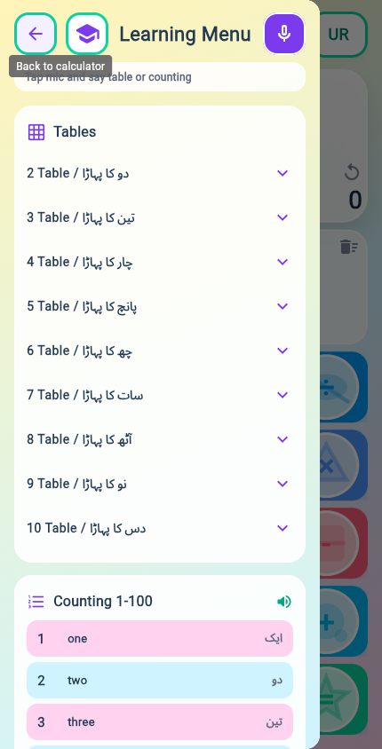

# Rainbow Calculator

Rainbow Calculator is a colorful Flutter calculator for children and early learners. It combines arithmetic, spoken answers, bilingual learning support, multiplication tables, counting practice, voice commands, and calculation history.

## Documentation

Full app documentation with screenshots is available here:

[docs/APP_DOCUMENTATION.md](docs/APP_DOCUMENTATION.md)

## Quick Start

```powershell
flutter pub get
flutter analyze
flutter test
flutter run -d chrome
```

## Screenshots




