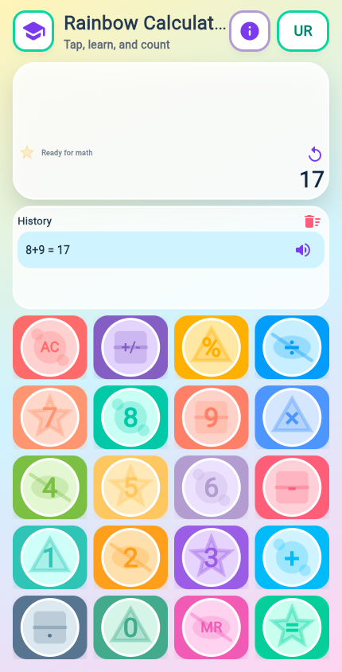

# Rainbow Calculator App Documentation

Rainbow Calculator is a colorful Flutter calculator designed for children and early learners. It combines basic arithmetic, spoken feedback, bilingual learning support, multiplication tables, counting practice, calculation history, and voice commands in one app.

Version: `1.0.0+1`  
Branding: OneNet Solutions Pakistan  
Primary code: `lib/main.dart`

## Screenshots

### Calculator Home


The home screen contains the calculator display, history panel, learning menu button, language toggle, about button, and the colorful keypad.

### Learning Menu


The learning drawer gives quick access to multiplication tables from 2 to 10, counting from 1 to 100, a voice command button, and spoken learning controls.

### Calculation History



Completed calculations are stored in the history panel. Each history row can be replayed with text-to-speech.

## Main Features

- Basic calculator operations: addition, subtraction, multiplication, division, percent, sign toggle, decimal input, clear, and equals.
- Memory recall button through `MR`.
- Large, playful number and operator buttons suited for younger users.
- Text-to-speech feedback for button presses, answers, history playback, learning content, and app information.
- Urdu and English speech modes with a visible `UR` language toggle.
- Learning drawer with multiplication tables from 2 through 10.
- Counting practice from 1 to 100 with spoken output.
- Voice command support for learning actions such as table reading and counting.
- Recent calculation history with replay and clear actions.
- Splash screen and app branding.
- Cross-platform Flutter project structure for Android, iOS, macOS, Windows, Linux, and Web.

## User Guide

### Open the Learning Menu

Tap the graduation-cap button in the top-left header. The side drawer opens with:

- Tables section for 2 to 10 tables.
- Counting 1-100 section.
- Microphone button for voice learning commands.
- Stop button while table or counting speech is active.

### Use the Calculator

1. Tap number buttons to enter a value.
2. Tap an operator such as `+`, `-`, `x`, or divide.
3. Enter the next value.
4. Tap `=` to calculate.
5. The result is spoken and added to history.

### Replay an Answer

After a calculation, tap the replay icon in the display panel to hear the last answer again.

### Use Calculation History

The app stores up to five recent calculations. In the History panel:

- Tap the speaker icon on a row to hear that calculation again.
- Tap the clear-history icon to remove all history entries.

### Switch Spoken Language

Tap the `UR` button in the header to toggle the spoken language mode. The app supports English, Urdu, and Roman Urdu style spoken labels depending on the current state.

### Use Voice Commands

Open the Learning Menu and tap the microphone button. Then say a command such as:

- `read table 2`
- `table 5`
- `counting`
- `ginti`

If the recognizer cannot match the speech, the app shows a retry prompt instead of treating it as a service failure.

## Learning Features

### Multiplication Tables

The table list includes 2 through 10. Expanding or selecting a table starts spoken table reading and highlights the active row while speech is running.

### Counting Practice

The counting section lists numbers 1 through 100 with English and Urdu labels. Spoken counting can run in chunks, and the app can prompt the user to continue after a range is complete.

## Accessibility And Audio

Rainbow Calculator uses audio feedback heavily:

- Every calculator button can be spoken.
- Answers are spoken after successful calculations.
- History entries can be replayed.
- Learning content is spoken during tables and counting.
- About/version information can be spoken.

The app catches unavailable text-to-speech environments so tests and unsupported devices do not crash.

## Speech Recognition Behavior

Speech recognition is powered by `speech_to_text`.

Recoverable recognition errors are treated as retry states:

- `error_no_match`
- `error_speech_timeout`
- `error_client`

Network errors trigger an offline retry path where supported. True service failures still show a speech-service unavailable message with platform-specific hints.

## Platform Permissions

### Android

The app declares:

- `android.permission.RECORD_AUDIO`
- `android.permission.INTERNET`
- Speech recognition service query for `android.speech.RecognitionService`

If speech recognition is unavailable on Android, install or enable Speech Services by Google and confirm microphone permission is granted.

### iOS

The app declares:

- `NSMicrophoneUsageDescription`
- `NSSpeechRecognitionUsageDescription`

iOS users must allow microphone and speech recognition permissions when prompted.

### Windows

If speech is unavailable on Windows, enable Windows speech recognition and microphone privacy permissions.

## Project Structure

```text
lib/main.dart                         Main app UI, calculator logic, speech, learning drawer
assets/app_icon/classic_kid_icon.png  App icon asset
android/                              Android platform project
ios/                                  iOS platform project
macos/                                macOS platform project
windows/                              Windows platform project
linux/                                Linux platform project
web/                                  Web platform project
test/widget_test.dart                 Widget tests
docs/screenshots/                     Documentation screenshots
tools/capture_docs_screenshots.ps1    Local screenshot capture helper
```

## Dependencies

Main runtime dependencies:

- `flutter_tts` for text-to-speech.
- `speech_to_text` for voice command recognition.
- `cupertino_icons` for icon support.

Development dependency:

- `flutter_test` for widget testing.

## Developer Setup

Install Flutter, then run:

```powershell
flutter pub get
flutter analyze
flutter test
```

Run on Chrome:

```powershell
flutter run -d chrome
```

Run on Windows desktop:

```powershell
flutter run -d windows
```

Build web output:

```powershell
flutter build web
```

Build Android debug APK:

```powershell
flutter build apk --debug
```

## Screenshot Capture

The screenshots in this documentation were captured from the Flutter web build.

1. Build the web app:

```powershell
flutter build web
```

2. Serve the build output locally:

```powershell
python -m http.server 7357 --directory build\web
```

3. Capture screenshots:

```powershell
powershell -ExecutionPolicy Bypass -File tools\capture_docs_screenshots.ps1
```

The script writes PNG files to `docs/screenshots/`.

## Testing

Use static analysis for code quality:

```powershell
flutter analyze
```

Use widget tests for UI behavior:

```powershell
flutter test
```

Existing tests cover startup, language and speech-related flows, the learning drawer, table selection, counting visibility, and stopping active learning speech.

## Troubleshooting

### Speech unavailable on Android

- Grant microphone permission.
- Install or enable Speech Services by Google.
- Confirm the device has a working microphone.
- Confirm the app has network access if online speech recognition is needed.

### `error_no_match`

This means the recognizer did not confidently match the spoken words. Tap the microphone and try again. Speak a short command such as `table 2` or `counting`.

### Text-to-speech does not play

- Confirm device volume is up.
- Check that a TTS engine is installed and enabled.
- On Android, install or enable a speech engine such as Google Text-to-Speech.

### Web build shows WebAssembly warnings

The current web build may report WebAssembly dry-run warnings from `flutter_tts_web`. The app still builds for normal web JavaScript output. Address the plugin warnings only if WebAssembly output becomes a target.

## Maintenance Notes

- Keep voice error handling user-friendly; recognition misses should not be labeled as full service failures.
- Keep screenshots current after UI changes.
- Keep platform permission text aligned with app behavior.
- Run `flutter analyze` after code changes.
- Run widget tests after changing calculator logic, speech behavior, or learning drawer flows.
